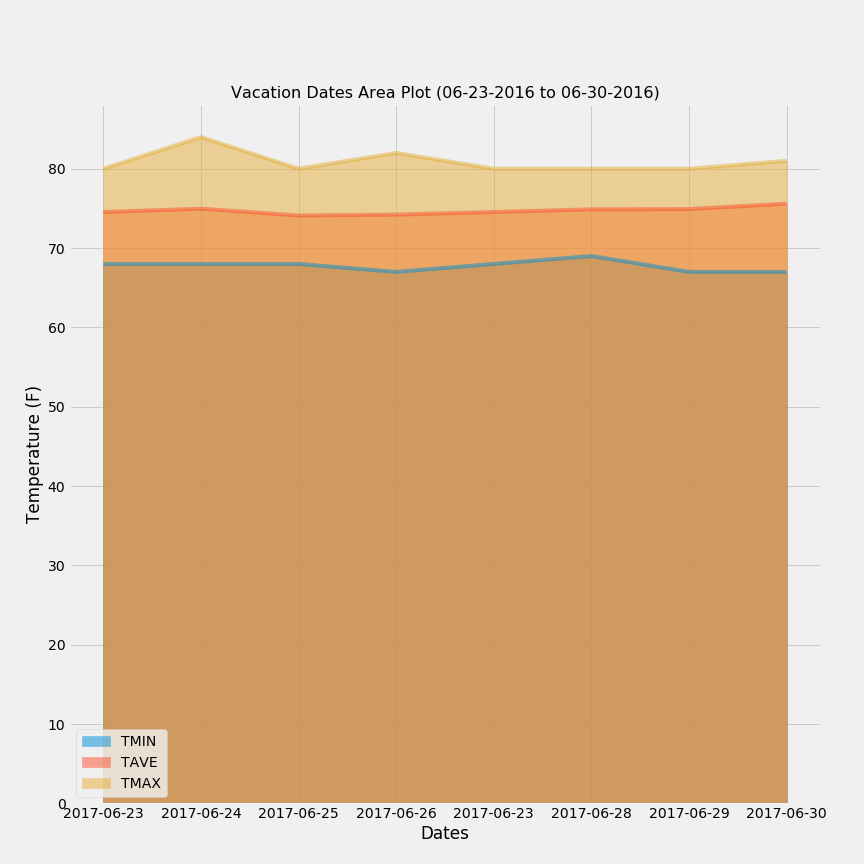

# SQLAlchemy - Surfs Up!


## Step 1 - Climate Analysis and Exploration

Use Python and SQLAlchemy to do basic climate analysis and data exploration of the climate database. All of the following analysis should be completed using SQLAlchemy ORM queries, Pandas, and Matplotlib.

* Choose a start date and end date for your trip. Make sure that your vacation range is approximately 3-15 days total.

* Use SQLAlchemy `create_engine` to connect to your sqlite database.

* Use SQLAlchemy `automap_base()` to reflect your tables into classes and save a reference to those classes called `Station` and `Measurement`.

### Precipitation Analysis

* Design a query to retrieve the last 12 months of precipitation data.

* Load the query results into a Pandas DataFrame and set the index to the date column.

* Sort the DataFrame values by `date`.

* Plot the results using the DataFrame `plot` method.


### Station Analysis

* Design a query to calculate the total number of stations.

* Design a query to find the most active stations.

* Design a query to retrieve the last 12 months of temperature observation data (TOBS).


## Step 2 - Climate App

Design a Flask API based on the queries that you have just developed.

### Routes

* `/`

  * Home page.

  * List all routes that are available.

```
@app.route("/")
def welcome():
    """List all available api routes."""
    return (
        f"Available Routes:<br/>"
        f"<a href='/api/v1.0/billingcountry'>billingcountry</a><br/>"
        f"<a href='/api/v1.0/countrytotal'>countrytotal</a><br/>"
        f"<a href='/api/v1.0/postcodes/USA'>postcodes/USA</a><br/>"
        f"<a href='/api/v1.0/countryitemtotals/USA'>countryitemtotals/USA</a><br/>"
        f"<a href='/api/v1.0/postcodeitemtotals/USA'>postcodeitemtotals/USA</a><br/>"
    )

```

* `/api/v1.0/precipitation`

  * Convert the query results to a dictionary using `date` as the key and `prcp` as the value.

  * Return the JSON representation of your dictionary.

```
@app.route("/api/v1.0/precipitation")
def precipitation():
  """Convert the query results to a dictionary using `date` as the key and `prcp` as the value.."""
  session = Session(engine)
  results = session.query(measurement.date, measurement.prcp).order_by(measurement.date).all()

  session.close()

  # Create a dictionary and append to a list of results
  precip_results = []

  for date, prcp in results:
      item_dict = {}
      item_dict["date"] = date
      item_dict["precipitation"] = prcp
      precip_results.append(item_dict)

  return jsonify(precip_results)
```

* `/api/v1.0/stations`

  * Return a JSON list of stations from the dataset.

```
@app.route("/api/v1.0/stations")
def stations():
  """Return a JSON list of stations from the dataset."""
  session = Session(engine)
  results = session.query(station.station).all()

  session.close()

  return jsonify(results)
```

* `/api/v1.0/tobs`

  * Query the dates and temperature observations of the most active station for the last year of data.
  
  * Return a JSON list of temperature observations (TOBS) for the previous year.

```
@app.route("/api/v1.0/tobs")
def tobs():
  """Query the dates and temperature observations of the most active station for the last year of data."""
  """Return a JSON list of temperature observations (TOBS) for the previous year."""
  session = Session(engine)

  # Query the most active station for the last year
  top_station = session.query(measurement.station).\
                group_by(measurement.station).\
                order_by(func.count(measurement.prcp).desc()).first()

  last_day = session.query(measurement.date).order_by(measurement.date.desc()).first()
  query_year = (dt.datetime.strptime(last_day[0],'%Y-%m-%d') - dt.timedelta(days=365)).strftime('%Y-%m-%d')

  results = session.query(measurement.date, measurement.tobs).\
    filter(measurement.station == top_station[0]).\
    filter(measurement.date >= query_year).all()

  session.close()

  # Create a dictionary and append to a list of results
  tobs_results = []

  for date, tobs in results:
      item_dict = {}
      item_dict["date"] = date
      item_dict["tobs"] = tobs
      tobs_results.append(item_dict)

  return jsonify(tobs_results)
```

* `/api/v1.0/<start>` and `/api/v1.0/<start>/<end>`

  * Return a JSON list of the minimum temperature, the average temperature, and the max temperature for a given start or start-end range.

  * When given the start only, calculate `TMIN`, `TAVG`, and `TMAX` for all dates greater than and equal to the start date.

  * When given the start and the end date, calculate the `TMIN`, `TAVG`, and `TMAX` for dates between the start and end date inclusive.

```
@app.route("/api/v1.0/<start>")

def start_date(start):
  """Return a JSON list of the minimum temperature, the average temperature, and the max temperature for a given start date."""
  
  session = Session(engine)
  results = session.query(func.min(measurement.tobs), func.avg(measurement.tobs), func.max(measurement.tobs)).\
            filter(measurement.date >= start).all()

  session.close()

  # Create a dictionary and append to a list of results
  start_results = []

  for min, avg, max in results:
      item_dict = {}
      item_dict["min"] = min
      item_dict["average"] = avg
      item_dict["max"] = max
      start_results.append(item_dict)

  return jsonify(start_results)
```

```
@app.route("/api/v1.0/<start>/<end>")
def start_end_date(start, end):
  """Return a JSON list of the minimum temperature, the average temperature, and the max temperature for a given start and end date."""
  
  session = Session(engine)
  results = session.query(func.min(measurement.tobs), func.avg(measurement.tobs), func.max(measurement.tobs)).\
            filter(measurement.date >= start).filter(measurement.date <= end).all()

  session.close()

  # Create a dictionary and append to a list of results
  end_results = []

  for min, avg, max in results:
      item_dict = {}
      item_dict["min"] = min
      item_dict["average"] = avg
      item_dict["max"] = max
      end_results.append(item_dict)

  return jsonify(end_results)
```

## Bonus: Other Recommended Analyses

### Temperature Analysis II

* Use the `calc_temps` function to calculate the min, avg, and max temperatures for your trip using the matching dates from the previous year.

* Plot the min, avg, and max temperature from your previous query as a bar chart.

  * Use the average temperature as the bar height.

  * Use the peak-to-peak (TMAX-TMIN) value as the y error bar (YERR).

    

### Daily Rainfall Average

* Calculate the rainfall per weather station using the previous year's matching dates.

* Calculate the daily normals. Normals are the averages for the min, avg, and max temperatures.

* Create a list of dates for your trip in the format `%m-%d`. Use the `daily_normals` function to calculate the normals for each date string and append the results to a list.

* Load the list of daily normals into a Pandas DataFrame and set the index equal to the date.

* Use Pandas to plot an area plot (`stacked=False`) for the daily normals.

  
